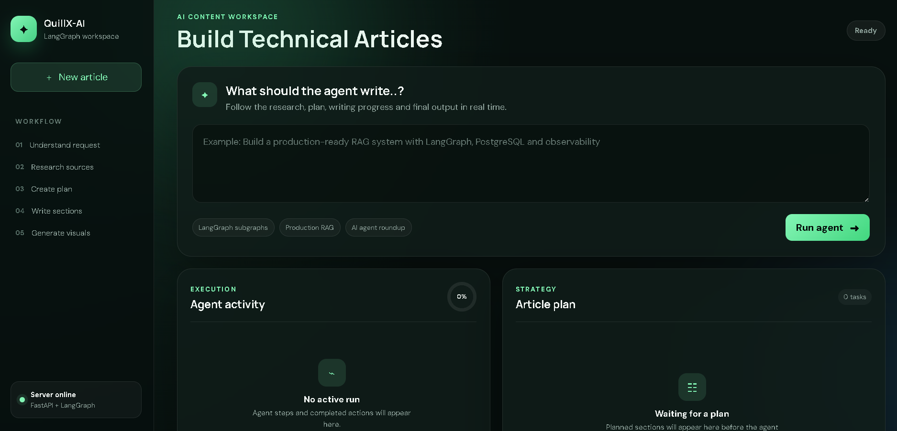
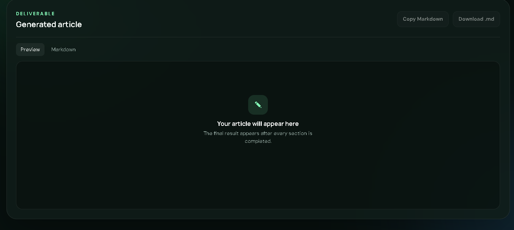

<div align="center">

###  ***QuillX-AI***

#### 🤖 Multi-Agent AI Technical Article Generator powered by LangGraph

Generate complete technical articles with **Research • Planning • Writing • Markdown Export • AI Workflow**

<p align="center">

</p>

<p align="center">


</p>

<p align="center">

<a href="https://quillx-ai.onrender.com/" target="_blank">

</a>

</p>

</div>

---

#### 🌟 ***About QuillX-AI***

**QuillX-AI** is a Multi-Agent AI Technical Article Generator built using **LangGraph**, **FastAPI**, and **React**.

Instead of manually researching, planning, and writing technical blogs, users simply enter a topic and QuillX-AI automatically performs the complete workflow.

The system coordinates multiple AI agents that work together to:

- Understand the request
- Research relevant sources
- Generate an article outline
- Write each section
- Assemble the final article
- Export Markdown ready for GitHub, Dev.to, Hashnode, or Medium

---

### 🚀 Live Demo

- 🌐 Web Application
> **🔗 [QuillX-AI](https://quillx-ai.onrender.com/)**

---

### ***📸 Project Preview***

#### ***Home Dashboard***

<p align="center">

</p>

---

#### ***Final Output***

<p align="center">

</p>

---

#### ***Features ✨***

- 🤖 Multi-Agent AI Workflow
- 📚 Automatic Research
- 📝 AI Generated Technical Articles
- 📋 Intelligent Article Planning
- 📄 Markdown Export

---

### 🧠 Multi-Agent Workflow

```text
                    User Topic
                        │
                        ▼
             Understand Request Agent
                        │
                        ▼
              Research Sources Agent
                        │
                        ▼
                 Planning Agent
                        │
                        ▼
              Section Writer Agent
                        │
                        ▼
              Markdown Generator
                        │
                        ▼
                Final Article Output
```

---

#### ⚡ Example Prompt

```text
Build a production-ready RAG system using LangGraph,
PostgreSQL and Observability.

Include:

• Architecture
• Implementation
• Code Examples
• Best Practices
• Deployment
```

---

### ***Tech Stack  🛠***

- ***Framework & LLM***
   - LangGraph | LangChain | Groq LLM

- ***Backend***
   - Python 3.11 | FastAPI | Pydantic | AsyncIO

- ***Frontend***
   - JavaScript | HTML5 | CSS3

-  ***Deployment***
    - Docker | Render

---

#### 🧩 AI Workflow

```
Understand Request
        │
        ▼
Research Sources
        │
        ▼
Create Strategy
        │
        ▼
Write Sections
        │
        ▼
Generate Markdown
        │
        ▼
Download Article
```

---


---

####  ***Workflow Stages 🎯***

✔ Understand Request

✔ Research Sources

✔ Create Article Plan

✔ Write Sections

✔ Generate Markdown

✔ Export Final Article

---

####  ***Future Improvements***

- AI Image Generation
- Citation Management
- PDF Export
- DOCX Export
- Multi-language Support
- SEO Optimization
- Team Collaboration
- User Authentication
- History Dashboard
- Cloud Storage
- Version Control

---


### ***Developer 👨‍💻***

<div align="center">

#### Ankit Gupta

### AI Engineer • AI Backend Developer • GenAI & Agentic AI Developer

Building intelligent AI systems using

**LangGraph • LangChain • FastAPI • LLMs • Machine Learning • Agentic AI**

</div>

---

#### ⭐ Support

- If this project helped you,

- please consider giving it a ⭐ on GitHub.

- It motivates me to continue building high-quality open-source AI projects.

---

<div align="center">

####  ***QuillX-AI ✨***

### Research Smarter. Write Faster. Powered by Multi-Agent AI.

Made with ❤️ by **Ankit Gupta**

</div>
